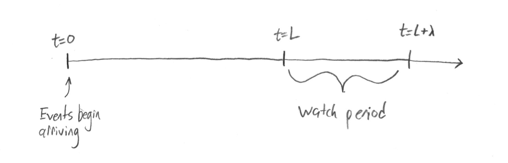

```{r setup, include=FALSE}
knitr::opts_chunk$set(echo = TRUE)

library(foreach)
library(ggplot2)
library(gridExtra)
```

# The Gamma-Count Distribution

The gamma-count distribution is a count distribution where event arrival times are distributed according to a gamma distribution. It is a generalization of a Poisson distribution, since the exponentially distributed arrival times of a Poisson process are special cases of the gamma distributed arrival times in this process. See @zeviani2013gammacount for a detailed derivation of the gamma-count PMF, but the version I will be referencing I describe below.

We say $X \sim gc(\lambda,\alpha)$ if $X$ is an event count from such a process. Since the scale of the arrival times and the length of watch time are confounded, WLOG assume arrival times have expectation 1 and are distributed $gamma(\alpha, \alpha)$. Then assume that arrivals are counted in the interval $(0, \lambda]$. Then for $n \geq 1$,

$$P(X<n) = \int_{\lambda}^{\infty} \frac{\alpha^{n\alpha}}{\Gamma(n\alpha)} x^{n\alpha - 1} e^{-\alpha x} dx = \int_{\lambda\alpha}^{\infty} \frac{1}{\Gamma(n\alpha)} u^{n\alpha - 1} e^{-u} du,$$

which is the upper regularized incomplete gamma function and

$$
P(X=n) = \begin{cases}
P(X < n+1) - P(X < n), & n \geq 1 \\ 
P(X < 1), & n = 0 \end{cases}
$$

# Problematic Edge Behavior {#problems}

There is a problem that occurs with these counts when $\alpha$ is small (overdispersion) or large (underdispersion). It comes from the fact that the first arrival time begins "waiting" at $t=0$, as if there were an unobserved event which arrived exactly at $t=0$. For a Poisson process (special case of $\alpha = 1$) this doesn't really matter because the exponential distribution is memoryless. However if $\alpha >> 1$ then the next event will be unlikely to occur soon, and for $\alpha \approx 0$ the process will be very likely to start with a cluster of early events before the next longer gap.

If $\lambda$ is large this has less effect because the early times account for less of the total watch time. But if $\lambda$ is small, then this early behavior dominates the whole process.

```{r distfuncs, include=FALSE}
# Compute the upper regularized incomplete gamma function with parameter a and
# lower integral bound x
uri.gamma <- function(x, a, log=FALSE) {
  pgamma(x, shape=a, rate=1, lower.tail=FALSE, log.p=log)
}

# Gamma count distribution
# Like poisson, but arrivals are gamma(alpha,alpha).
# Wait time is lambda, like poisson. Arrival times are still mean=1.
# poisson is a special case with alpha=1.

dgc <- function(x, lambda, alpha=1) {
  uri.gamma(lambda*alpha, (x+1)*alpha) - uri.gamma(lambda*alpha, x*alpha)
}

pgc <- function(x, lambda, alpha=1) {
  uri.gamma(lambda*alpha, (x+1)*alpha)
}

rgc <- function(n, lambda, alpha=1) {
  x <- rep(-1, n)
  u <- runif(n)
  i <- 0
  while (any(x < 0)) {
    x[(pgc(i, lambda, alpha) >= u) & (x < 0)] <- i
    i <- i + 1
  }
  x
}
```

```{r plotmeanvar1, echo=FALSE, fig.width=10, fig.height=5}
lambda.vals <- seq(0.02, 3, by=0.02)
alpha.vals <- c(1, 2, 10, 20)
max.x <- 100

# Create data frame of means and variances for each lambda and alpha
meanvar <- foreach(alpha=alpha.vals, .combine="rbind") %do% {
  foreach(lambda=lambda.vals, .combine="rbind") %do% {
    x <- c(0, seq_len(max.x))
    probs <- dgc(x, lambda, alpha)
    data.frame(lambda=lambda, alpha=alpha, 
               mean=sum(probs * x),
               var=sum(probs * x^2) - sum(probs * x)^2)
  }
}
meanvar$alpha <- as.factor(meanvar$alpha)

meanplot <- ggplot(meanvar, aes(x=lambda, y=mean, color=alpha)) + geom_line()
varplot <- ggplot(meanvar, aes(x=lambda, y=var, color=alpha)) + geom_line()
grid.arrange(meanplot, varplot, ncol=2)
```

This problem is illustrated in the above plots of means and variances for select underdispersed gammacount distributions at small $\lambda$. The "waviness" in the mean and variance graphs is problematic. Ideally, the mean of each of these distributions would be closer to $\lambda$, would increase at a constant rate, and the variance would be close to a constant multiple of the mean.

# Adjustments for Edge Behavior

## Random Starting Time

I attempt to fix this by adjusting the starting time of the process away from $t=0$. That is, instead of counting events during the interval $(0,\lambda]$ we count events during the interval $(L,L+\lambda]$ for some start time $L$. The intuition is that if $L$ is large enough, then no matter how regular or clustered arrivals are in the process their locations near $L$ are uncertain.



If $\alpha=1$ (the process is a Poisson process) then the time $L$ doesn't affect the distribution of counts, again, since the exponential distribution is memoryless.

Instead of fixing $L$ large, instead imagine we are somehow able to randomly choose $L$ on the whole of the positive finite number line. Alternatively, imagine $L \sim unif(0, m)$ and let $m \to \infty$.

## Distribution of First Arrival Time with Random Start {#first-arrival-distribution}

A random starting time $L>0$ could be difficult to work with, but the problem can be simplified through reframing. We can ask, if we begin counting events at some random time $L$, what is the distribution of time until the first event arrives after $L$? We can then redefine the process starting at $t=0$ but with the first arrival time having this new distribution, and all subsequent arrivals being gamma distributed as before. I'll find this distribution.

We want the distribution of the time until the first event after some random time $L>0$. This will depend a lot on intuitive reasoning and not really on precise definitions.

\begin{enumerate}
\item First, assume that the gaps between subsequent events, $\delta_i$, are distributed with some density $f(\delta)$. 
\item Now consider the size of the gap in which we will find ourselves at time $L$. Intuitively, the probability of landing in a gap is proportional to the size of that gap. Gaps which are twice as long are twice as likely to be landed in, for example. Then if $X$ is the size of the gap in which time $L$ lands, $X$ will have a density of $xf(x)/\int xf(x) = xf(x)/E[\delta_i]$, assuming $\delta_i$ has finite expectation.
\item Finally, the specific location of $L$ within the gap is (intuitively) uniformly distributed. So the wait time until the next event after $L$, which we call $W$, has conditional distribution $W|X=x \sim uniform(0, x)$.
\item Then the joint density of $W$ and $X$, $g(w,x) = (1/x) \cdot xf(x)/E[\delta_i] = f(x)/E[\delta_i]$, subject to $0 \leq w \leq x$.
\item Finally, we marginalize out $X$ to get the marginal density of $W$ as $g(w) = P(\delta_i > w)/E[\delta_i]$.
\end{enumerate}

# Extended Gamma-Count Distribution

In this section I extend the gamma-count distribution to represent a random start time, instead of a fixed $t=0$ start time. The goal of this is to remedy the problems described in section \ref{problems}.

## Conditioning on the first arrival time {#condition-on-time}

Let $X \sim gc(\lambda, \alpha)$, and define $\tau$ as the first arrival time of an event in the process associated with $X$. Consider the conditional distribution of $X|\tau$. For the case $\tau > \lambda$, we know $P(X=0|\tau > \lambda)=1$ because no events arrived in the interval $(0,\lambda]$. However for $\tau \leq \lambda$ we can say $X-1|\tau\leq\lambda \sim gc(\lambda-\tau, \alpha)$ because we know the first event occurred at $\tau \in (0,\lambda]$, after which the interval $(\tau,\lambda]$ can be treated as a gamma-count process since we have an uncounted event occuring exactly at its beginning. In summary, if $X \sim gc(\lambda, \alpha)$ and $\tau$ is the arrival time of the first event in the process associated with $X$, then

$$
P(X=x|\tau) = \begin{cases}
1, & \tau > \lambda, x=0 \\
0, & \tau > \lambda, x>0 \\
P(Y=x-1),\ Y\sim gc(\lambda-\tau,\alpha) & \tau \leq \lambda
\end{cases}
$$

## Generalized first arrival gamma-count process (gct)

Now we'll generalize the gamma-count distribution in the following way. Define the generalized first arrival gamma-count process in the same way as the gamma count process before. If $X \sim gct(\lambda, \alpha, P_\tau)$ then $X$ is the count of events which arrived in the interval $(0,\lambda]$. All arrival times (from one event to the next) are distributed $gamma(\alpha,\alpha)$ *except the first*, which is distributed according to the distribution $P_\tau$. The $gct$ distribution is then parametrized by two positive real numbers $\lambda$ and $\alpha$, and a probability measure $P_\tau$ whose support is contained in the positive reals. If $X \sim gct(\lambda, \alpha, P_\tau)$ then

$$P(X=x) = \int P(X=x|\tau) P_\tau(d\tau),$$

with $P(X=x|\tau)$ as defined in section \ref{condition-on-time}.

Some notable choices for $P_\tau$ are $gamma(\alpha,\alpha)$ which results in a standard $gc(\lambda,\alpha)$ distribution, or the distribution $g(w)$ from section \ref{first-arrival-distribution}, which would create a count from a gamma-count process with random start time.

```{r distfuncs2, include=FALSE}
# Distribution of first arrival time of a gamma-count process with random
# observation start time L

dft <- function(x, alpha=1) {
  pgamma(x, shape=alpha, rate=alpha, lower.tail=FALSE)
}

# Generalized gamma-count distribution
# Gamma-count process with the "first arrival time" distribution for the first
# arrival time

# x can be a vector but lambda and alpha must be scalars (length 1)
dgct <- function(x, lambda, alpha) {
  # Integrand is the joint density of first arrival and observed count
  integrand <- function(tau, x, lambda, alpha) {
    if ((tau <= lambda) && (x > 0)) {
      value <- dft(tau, alpha) * dgc(x - 1, lambda - tau, alpha)
    } else if ((tau >= lambda) && (x == 0)) {
      value <- dft(tau, alpha)
    } else {
      # x == 0 but first arrival was before lamda, or x > 0 but first arrival
      # after lambda
      value <- 0
    }
    return(value)
  }
  # For each value of x, integrate to find marginal probability of x
  probs <- rep(0, length(x))
  for (i in 1:length(x)) {
    # What are the possible values of tau based on x? (Performance save: all
    # other values of tau have probability zero)
    if (x[i] == 0) {
      lower <- lambda
      upper <- Inf
    } else {
      lower <- 0
      upper <- lambda
    }
    integ.res <- integrate(f=integrand, lower=lower, upper=upper, 
                           x[i], lambda, alpha)
    probs[i] <- integ.res$value
  }
  probs
}
```

```{r plotmeanvar2, echo=FALSE, fig.width=10, fig.height=5}
lambda.vals <- seq(0.02, 3, by=0.02)
alpha.vals <- c(1, 2, 10, 20)
max.x <- 100

# Create data frame of means and variances for each lambda and alpha
meanvar <- foreach(alpha=alpha.vals, .combine="rbind") %do% {
  foreach(lambda=lambda.vals, .combine="rbind") %do% {
    x <- c(0, seq_len(max.x))
    probs <- dgct(x, lambda, alpha)
    data.frame(lambda=lambda, alpha=alpha, 
               mean=sum(probs * x),
               var=sum(probs * x^2) - sum(probs * x)^2)
  }
}
meanvar$alpha <- as.factor(meanvar$alpha)

meanplot <- ggplot(meanvar, aes(x=lambda, y=mean, color=alpha)) + geom_line()
varplot <- ggplot(meanvar, aes(x=lambda, y=var, color=alpha)) + geom_line()
grid.arrange(meanplot, varplot, ncol=2)
```

The plots above show the generalized gamma-count distribution with $P_\lambda$ chosen to be the distribution $g(w)$ from section \ref{first-arrival-distribution}. See how now $\lambda$ directly parametrizes the mean at all values of $\alpha$. Also, the waviness in the variance has been reduced (but not eliminated).

## Joint gct distribution

It may also be useful to consider the joint distribution of $X,\tau$ where $X \sim gct(\lambda, \alpha, P_\tau)$, for example, if attempting to use the $gct$ distribution in generalized linear regression. We may consider $\tau$ as an unobserved response associated with each $X$ which may be imputed or modeled in a Bayesian setting to avoid integrating over $\tau$ in $X$'s distribution.

# References
